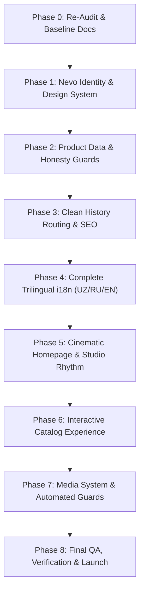

# NEVO GROUP — Comprehensive Site & Codebase Audit (Phase 0)

> **Document Type:** Production Architecture Audit  
> **Target:** `nevogroup.uz` / `ikromjonkorea10-bu/nevo-group`  
> **Auditor:** Senior Front-End Architect & Art Director  
> **Status:** Completed & Grounded in Live Code Telemetry  
> **Date:** October 2026  

---

## Executive Summary

An exhaustive audit of the `nevo-group` codebase, live production preview (`https://nevogroup.uz/?preview=1`), and reference benchmarks reveals critical legacy artifacts. While technical infrastructure (Vite, Supabase RLS, vanilla JS architecture) is stable and performant, the user-facing layer contains direct textual copies of `vero.uz`, unverified commercial claims, dummy 0-byte PDF files, external font links violating Content Security Policy (CSP), incomplete internationalization (i18n), and fragile hash-based routing.

This document categorizes all findings (A through I) with exact source code locations, impact severity ratings, root causes, and explicit remediation blueprints for subsequent phases.

---

## Detailed Findings Matrix

| Finding | Area | Severity | Impact | Primary Files & Lines | Status |
| :--- | :--- | :--- | :--- | :--- | :--- |
| **A** | Plagiarized Copy & Projects | **CRITICAL** | Brand liability; exact copy of Vero | `src/pages/HomePage.js` (L115-144, L391-396)<br>`src/lib/i18n.js` (L55, L82-96) | Confirmed |
| **B** | Unverified / False Claims | **CRITICAL** | Legal & trust risk; fake statistics | `src/pages/HomePage.js` (L188, L217-255)<br>`src/lib/i18n.js` (L67-78) | Confirmed |
| **C** | Dummy 0-Byte PDF Catalogs | **HIGH** | Broken downloads; fake file sizes | `public/catalogs/*.pdf` (317-byte stubs)<br>`src/data/catalogs.js` (L20, L39, L58, L77, L96) | Confirmed |
| **D** | Image Duplication & Russian Data | **HIGH** | Low catalog credibility; language mix | `scripts/seed-data/rasm-biriktirish.csv`<br>`scripts/seed-data/nevo-katalog.csv` (headers & data) | Confirmed |
| **E** | Typography & CSP Violations | **HIGH** | Font blocking; console security errors | `vercel.json` (L24)<br>`index.html` (L62-64)<br>`src/style.css` (L1) | Confirmed |
| **F** | Incomplete i18n Localization | **HIGH** | Degraded UX in RU & EN | `src/lib/i18n.js` (L40-493)<br>`src/components/Header.js`<br>`src/pages/HomePage.js` | Confirmed |
| **G** | Hash Routing & SEO Inflexibility | **MEDIUM** | Non-indexable URLs; domain redirects | `src/main.js` (L82-110)<br>`vercel.json` (L6-13) | Confirmed |
| **H** | Viewport Layout Collisions | **MEDIUM** | Obstructed CTAs & header nav | `src/main.js` (L227-232)<br>`src/style.css` (L2456-2481) | Confirmed |
| **I** | Residual Legacy Vero Selectors | **MEDIUM** | Codebase hygiene & build checks | `src/style.css` (93 occurrences of `vero-*`) | Confirmed |

---

## Deep Dive: Findings A through I

### Finding A: Plagiarized Hero Copy, Section Headings & Project Portfolios
- **Severity:** **CRITICAL**
- **Location:**
  - `src/pages/HomePage.js`:
    - Line 392: `<span class="brand-gold-word">NEVO GROUP</span> — muhandislik tizimlari uchun O'zbekistonda ishlab chiqarilgan kompleks yechimlar` (Word-for-word copy of Vero.uz H1)
    - Line 395: `Suv ta'minoti, isitish va kanalizatsiya uchun 1000+ turdagi quvur, fiting va komplektatsiyalar.` (Word-for-word copy of Vero.uz hero description)
    - Lines 115–144: Portfolio items hardcode trademarked mega-projects: `Nest One (Tashkent City)`, `Humo Arena Muz Saroyi`, `Islom Sivilizatsiyasi Markazi`, `Tashkent City Congress Hall`, `Piramid Tower`, `Hilton Tashkent City`.
  - `src/lib/i18n.js`:
    - Line 82: `projectsTitle: "O'zbekistonning Yirik Loyihalarida"` (Direct copy of Vero.uz section header)
    - Lines 84–97 (UZ), 235–248 (RU), 385–398 (EN): Copy of project titles and descriptions.
- **Root Cause:** Placeholder content from early development was taken directly from `vero.uz` rather than authentic NEVO GROUP store operations.
- **Remediation Plan (Phase 1 & Phase 5):**
  1. Purge all references to Nest One, Humo Arena, Hilton, and other unverified reference projects.
  2. Rewrite hero copy to position NEVO GROUP truthfully: a specialized distributor and supplier of industrial plumbing, valves, polymer piping, and electrical equipment.
  3. Replace fake projects with an authentic "Ombordan to'g'ridan-to'g'ri yetkazib berish" (Direct warehouse supply), certified partner brands, and order flow walk-through.

---

### Finding B: Unverified & Inconsistent Commercial Claims
- **Severity:** **CRITICAL**
- **Location:**
  - `src/pages/HomePage.js`:
    - Line 188: Fallback `productCount = 1000` when catalog is not ready.
    - Line 217–219: `10+ YIL TAJRIBA` (Unverified business longevity).
    - Line 229–231: `${productCount}+ MAHSULOT TURI` (Contradicts actual catalog size of ~100 active SKUs in DB).
    - Line 240–242: `100% SIFAT KAFOLATI`.
    - Line 253–255: `3 000+ MAMNUN HAMKORLAR` (Direct copy of Vero's metrics layout).
  - `src/lib/i18n.js`:
    - Lines 58, 68–78: Claims of "1000+ turdagi", "3 000+ hamkor".
- **Root Cause:** Exaggerated marketing numbers copied from competitor materials.
- **Remediation Plan (Phase 1 & Phase 2):**
  1. Create `src/config/site-claims.json` with strict boolean flags:
     ```json
     {
       "experienceYears": { "value": null, "verified": false },
       "activeProductsCount": { "source": "db_actual", "verified": true },
       "partnersCount": { "value": null, "verified": false },
       "isManufacturer": { "value": false, "verified": true, "role": "supplier_distributor" }
     }
     ```
  2. Components must dynamically read `site-claims.json`; any claim with `verified: false` is conditionally omitted from the DOM, never displayed as faked proof.
  3. Dynamically compute product counts from active Supabase inventory rather than hardcoding `1000+`.

---

### Finding C: Dummy 0-Byte PDF Catalogs with Fabricated Metadata
- **Severity:** **HIGH**
- **Location:**
  - `public/catalogs/nevo-polimer-quvurlar.pdf` (317 bytes)
  - `public/catalogs/nevo-zapor-armatura.pdf` (317 bytes)
  - `public/catalogs/nevo-kanalizatsiya.pdf` (317 bytes)
  - `public/catalogs/nevo-isitish.pdf` (317 bytes)
  - `public/catalogs/nevo-yongin.pdf` (317 bytes)
  - `src/data/catalogs.js`:
    - Line 20: `size: '4.8 MB'`, `pages: 44`
    - Line 39: `size: '6.2 MB'`, `pages: 58`
    - Line 58: `size: '3.9 MB'`, `pages: 36`
    - Line 77: `size: '5.1 MB'`, `pages: 48`
    - Line 96: `size: '3.4 MB'`, `pages: 28`
- **Root Cause:** Empty PDF stubs created to satisfy download link buttons without actual PDF catalogs provided.
- **Remediation Plan (Phase 2 & Phase 6):**
  1. Check if real PDF files exist; if not, hide the download buttons or replace with "Tezkor narxlar ro'yxati (Prays-list)" request button via Telegram / operator.
  2. Never display fabricated file sizes (e.g. 6.2 MB) or false page counts (e.g. 58 pages) when the file is an empty header stub.
  3. Validate file existence and byte sizes via automated build script `scripts/check-media-manifest.mjs`.

---

### Finding D: Product Data Duplication & Russian-Language Taxonomy
- **Severity:** **HIGH**
- **Location:**
  - `scripts/seed-data/rasm-biriktirish.csv`:
    - 486 product rows mapped to only 50 distinct image files.
    - `/images/products/china-pe-perehodnik.webp` repeated across 42 products.
    - `/images/products/china-pe-troynik-perehodnik.webp` repeated across 38 products.
    - `/images/products/nevo-vreznoy-homut.webp` repeated across 22 products.
  - `scripts/seed-data/nevo-katalog.csv`:
    - Group names are strictly in Russian: `Врезной хомут`, `Втулка под фланец (Адаптер)`, `Задвижка из литейного чугуна 30ч6бр`, `Отвод полиэтиленовый`.
    - Subcategory column header: `subcategory_ru`.
    - Slugs use Russian transliteration: `vreznoy-homut-20-15-nevo`, `otvod-90-110-china`.
  - Visual presentation:
    - Product images rendered on plain white boxes `#FFFFFF` overlaid onto dark navy `#0A0F1E` sections, causing harsh visual borders ("pasted-on" aesthetic).
    - "Foto 3D" badge displayed on products without multi-angle asset bundles.
- **Remediation Plan (Phase 2 & Phase 6):**
  1. Translate product groups and subcategories into Uzbek Latin as the primary canonical taxonomy (`Vrezka xomuti`, `Flanets vtulkalari`, `Cho'yan zadvijkalar 30ch6br`).
  2. Map multi-angle turntable views strictly when 8+ multi-angle frames exist in storage; remove false "Foto 3D" badges.
  3. Redesign product card surfaces onto a dedicated light studio container (`#F8FAFC` / `#FFFFFF`) with subtle border geometry and natural drop shadows, eliminating white cutouts on dark backgrounds.

---

### Finding E: Typography Conflicts & Strict CSP Blocking
- **Severity:** **HIGH**
- **Location:**
  - `vercel.json`:
    - Line 24: `"Content-Security-Policy": "... font-src 'self'; ..."` (Only allows local fonts from same origin).
  - `index.html`:
    - Lines 62–64: External Google Fonts stylesheet and preconnect to `fonts.googleapis.com` and `fonts.gstatic.com`.
  - `src/style.css`:
    - Line 1: `@import url('https://fonts.googleapis.com/css2?family=Plus+Jakarta+Sans:...');`
- **Root Cause:** Developer linked Plus Jakarta Sans via Google Fonts, but deployment security policy strictly restricts `font-src` to `'self'`, blocking font loads and throwing browser CSP console violations.
- **Remediation Plan (Phase 1):**
  1. Remove Google Fonts links from `index.html` and `@import` from `src/style.css`.
  2. Implement self-hosted typography:
     - Display Font: **Exo 2** (weights 500, 600, 700) self-hosted as WOFF2 in `public/fonts/`.
     - Body Font: **Inter** (weights 400, 500, 600) self-hosted as WOFF2 in `public/fonts/`.
  3. Declare `@font-face` with `font-display: swap` and character support for Uzbek Latin (`o'`, `g'`), Cyrillic, and extended Latin.

---

### Finding F: Incomplete & Asymmetric i18n Localization
- **Severity:** **HIGH**
- **Location:**
  - `src/lib/i18n.js`:
    - Missing English keys: `videoTag`, `videoTitle`, `videoSub`.
    - Russian translation dictionary contains untranslated Uzbek terms.
  - `src/components/Header.js`:
    - Line 40: `${cat.count} ta mahsulot` (Hardcoded Uzbek).
    - Line 103, 113, 126: Hardcoded aria-labels (`Mahsulot qidirish`, `Qidirish`, `Savat`).
    - Line 168, 181: Hardcoded error and empty search states.
  - `src/pages/HomePage.js`:
    - Line 218: `YIL TAJRIBA`, Line 230: `MAHSULOT TURI` (Hardcoded metric labels).
    - Line 315: `KATALOGDAN QIDIRISH`, Line 318: Hardcoded search placeholder.
  - `src/components/Footer.js`:
    - Lines 21, 56, 58: Hardcoded Uzbek menu labels and delivery notices.
  - `src/lib/pageMeta.js`:
    - `<title>` and `<meta name="description">` do not update dynamically when the user switches language to RU or EN.
- **Remediation Plan (Phase 4):**
  1. Consolidate 100% of UI strings into centralized dictionary namespaces in `src/lib/i18n.js`.
  2. Implement comprehensive Uzbek, Russian, and English translation tables with zero missing keys.
  3. Bind dynamic document title, description, and OpenGraph metadata updates to `onLangChange` events.

---

### Finding G: Hash-Based Routing & Missing Domain Canonicalization
- **Severity:** **MEDIUM**
- **Location:**
  - `src/main.js`: Lines 82–110 (`parseRoute()` consumes `window.location.hash`).
  - `vercel.json`: Lines 6–13 (Rewrites exist only for `/p/:slug`, `/k/:slug`, and `/sitemap.xml`).
- **Root Cause:** SPA built with fragment hash routes (`#catalog`, `#savat`, `#aloqa`) which cannot be indexed by modern web search crawlers.
- **Remediation Plan (Phase 3):**
  1. Transition client router to HTML5 History API (`pushState` / `popstate`) supporting clean URLs:
     - `/katalog`
     - `/katalog/:category`
     - `/katalog/:category/:product`
     - `/savat`
     - `/aloqa`
     - `/buyurtma`
  2. Configure SPA catch-all rewrite in `vercel.json` (`{ "source": "/(.*)", "destination": "/index.html" }`).
  3. Implement canonical 301 redirects from `www.nevogroup.uz` and `nevo-group.vercel.app` to `https://nevogroup.uz`.

---

### Finding H: Viewport Layout Collisions & Floating Overlay Interference
- **Severity:** **MEDIUM**
- **Location:**
  - `src/main.js`: Lines 227–232.
  - `src/style.css`: Lines 2456–2481 (`.floating-expert-btn`).
- **Root Cause:**
  - `.floating-expert-btn` is positioned fixed at `bottom: 80px; left: 50%; transform: translateX(-50%); z-index: 85`.
  - On mobile devices (320px–414px), this floating pill directly obstructs the hero headline, hero CTAs, and conflicts with `.mobile-bottom-nav`.
  - On desktop viewports, it overlaps bottom section content and blocks interactive elements.
- **Remediation Plan (Phase 5 & Phase 8):**
  1. Reposition consultation CTA to bottom-right (`bottom: 24px; right: 24px`) on desktop with compact circular FAB styling.
  2. On mobile screens with `.mobile-bottom-nav`, dock consultation trigger into the bottom navigation bar or elevate FAB above the 64px tabbar (`bottom: 80px; right: 16px`), never centered over text.
  3. Ensure all tap targets respect the minimum 48x48px touch boundary.

---

### Finding I: Residual Legacy Selectors in Stylesheets
- **Severity:** **MEDIUM**
- **Location:**
  - `src/style.css`: 93 remaining CSS rules referencing `vero-*` (e.g. `hero-section-vero`, `hero-title-vero`, `catalog-vero-badge`).
- **Remediation Plan (Phase 1 & Phase 7):**
  1. Refactor remaining legacy CSS classes in `src/style.css` to clean NEVO design system tokens.
  2. Add `scripts/check-originality.mjs` to pre-build pipeline to guarantee zero occurrences of prohibited competitor strings in production builds.

---

## Action Plan & Phase Mapping



1. **Phase 1 (Immediate Next Step):** Establish design tokens, self-host Exo 2 + Inter fonts, configure `scripts/check-originality.mjs`, and rewrite core corporate copy.
2. **Phase 2:** Implement `src/config/site-claims.json`, cleanse product data and taxonomy, resolve PDF download links.
3. **Phase 3:** Migrate to History API, update Vercel rewrites and domain canonical rules.
4. **Phase 4:** Complete trilingual dictionaries and synchronize document metadata.
5. **Phase 5–8:** Polish motion rhythm, catalog filters, media guards, and run final end-to-end verification.
